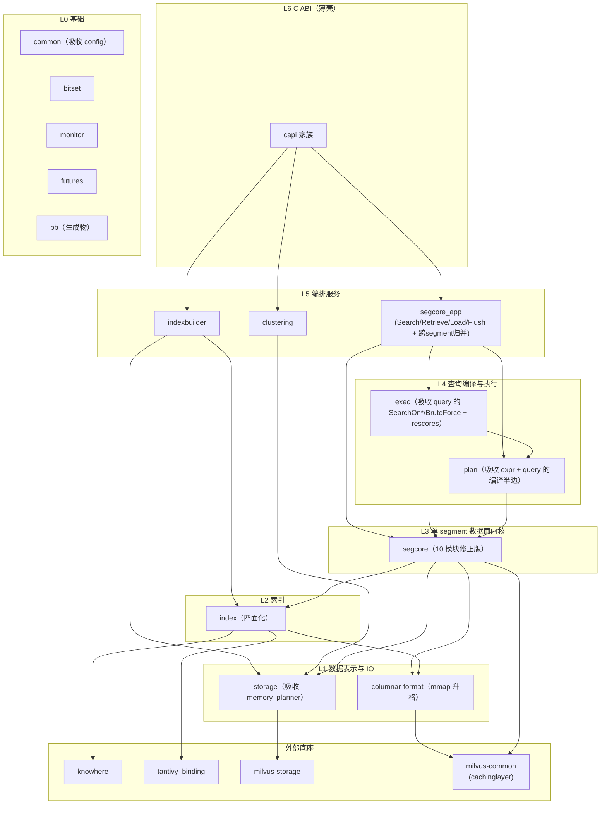

# Milvus C++ Core 重构总览

> **状态：设计提案，讨论中。** 本文档是 `internal/core` 整体重构的顶层总览：现状盘点、目标分层图、每个组件的一句话定义。
> 现状事实基于 master `e255009e01`。
>
> [segcore 章节](../segcore_refactor/README.md)（12 篇）先于本文档写成，视角限于 segcore 域内，后续将修订并降级为本总览的一章。

## 1. 范围

重构对象是 `internal/core/src` 全部约 **20.7 万行**生产代码，不只是 segcore。目标：**每个组件有一句话定义、可编译期验证的边界、单向依赖 DAG、可独立测试**。

## 2. 现状盘点

生产代码统计（排除测试文件）：

| 目录 | 文件数 | 行数 | milvus_core 聚合 target | 现状一句话 |
|---|---|---|---|---|
| `segcore/` | 107 | 46,709 | ✅ | segment 内核 + C ABI + 大量不属于它的内容 |
| `exec/` | 132 | 42,147 | ✅ | 向量化执行引擎（Driver/Operator/Expression） |
| `index/` | 66 | 29,247 | ✅ | 标量 + 向量索引实现，查询/growing 写入/构建/持久化四面混装 |
| `common/` | 96 | 25,902 | ✅ | 类型底座 + 杂物间 |
| `storage/` | 98 | 25,548 | ✅ | 对象存储 IO、binlog 编解码、file manager |
| `bitset/` | 33 | 16,932 | ✅ | SIMD 位图库 |
| `query/` | 26 | 6,237 | ✅ | plan 编译 + 向量检索算子 + 编排，三合一 |
| `mmap/` | 7 | 3,211 | ❌ **无 target**（[#51504](https://github.com/milvus-io/milvus/pull/51504) 转正中） | 列内存表示（ChunkedColumn 族），header-only 幽灵组件 |
| `rescores/` | 8 | 2,040 | ✅ | boost / function score 重打分 |
| `indexbuilder/` | 12 | 2,011 | ✅ | index node 的构建服务 C API |
| `minhash/` | 13 | 1,689 | ✅ | minhash 相似度计算 |
| `clustering/` | 7 | 1,192 | ✅ | kmeans analyze 服务 C API |
| `expr/` | 1 | 1,082 | ❌ **无 target** | `ITypeExpr.h` 单文件，幽灵组件 |
| `monitor/` | 8 | 971 | ✅ | prometheus 指标 |
| `plan/` | 3 | 912 | ✅ | 新式 PlanNode |
| `futures/` | 8 | 858 | ✅ | folly Future ↔ C ABI 桥 |
| `config/` | 2 | 189 | ✅ | 仅 knowhere 配置桥 |
| `pb/` | 生成物 | — | ✅ | protobuf 生成代码 |

构建形态：16 个组件 target 的对象聚合进单一 `milvus_core.so`，组件间无 `target_link_libraries` 边（[#35610](https://github.com/milvus-io/milvus/pull/35610) 的纪律，本重构继续遵守）。

### 盘点中的关键事实

1. **cachinglayer 不在本仓库。** `cachinglayer/CacheSlot.h`、`PinWrapper` 来自外部仓 **milvus-common**（thirdparty 依赖）。"pin 不得越出某模块"这类规则约束的是一条**跨仓依赖的传染面**，只能靠本仓 lint 执行。
2. **mmap/ 与 expr/ 是幽灵组件**：没有构建 target，靠 `src/CMakeLists.txt` 的全局 `include_directories` 存活，谁 include 谁编译，归属无从审查。
3. **query/ 站在错误的位置**：它同时被 segcore 依赖（`Search` 内部构造 `ExecPlanNodeVisitor`）又依赖 segcore 具体实现（`SearchOnGrowing.h` include `SegmentGrowingImpl`），是 `segcore ↔ query/exec` 环的另一半。
4. **外部底座有五个**，必须显式画进依赖图：knowhere、tantivy_binding、milvus-storage、milvus-common、arrow（另有 simdjson、libsais 等纯算法库）。

## 3. 目标分层图

三条关键性质：

- **exec / plan → segcore 的边只指向 `segcore/contracts`**（能力接口与描述符），不指向任何实现。
- **app 是唯一同时认识 segcore 实现与 exec 的地方**——这是打开 `segcore ↔ query/exec` 环的解。
- **cachinglayer（milvus-common）的类型只允许 columnar-format 与 segcore 内部可见**，不得出现在任何契约签名上。

## 4. 组件定义

每个组件一句话定义（目标态）+ 与现状的差异。**一句话定义是该组件的裁决器**：一段代码是否属于这个组件，用这句话判断。

| 组件 | 一句话定义（目标态） | 与现状的差异 |
|---|---|---|
| **bitset** | SIMD 加速的位图算法库，零 Milvus 依赖，可独立编译 | 不变 |
| **common** | 所有组件共享的类型底座：Schema、FieldMeta、值类型、错误处理、OpContext；不含领域逻辑，不依赖仓内任何其他组件 | 减肥：驱逐 `ArrayOffsets` 的 segcore 依赖等领域物；吸收 config |
| **monitor** | 指标的定义、注册与导出，只被动接收数据 | 不变 |
| **futures** | folly Future 与 C ABI 之间的异步桥，Go 侧 await C++ 结果的唯一机制 | 不变 |
| **pb** | proto 生成物；只允许各层的 adapter include | 新增 lint 规则 |
| **storage** | 字节与文件的世界：远端/本地 IO、binlog 编解码、加密压缩、读取规划；不认识 index、segment、查询 | 吸收 segcore 的 `memory_planner`、`default_fs`、packed/arrow_fs C 壳 |
| **columnar-format**（mmap 升格） | 列数据的统一内存表示与访问契约：Chunk、ChunkedColumn、Scan/Take 游标、cell 几何规划、**列的物理布局（含 zone-map 与 JSON shredding）**；storage 产出、segcore/exec 消费 | 转正与 Scan/Take 契约已由 [#51504](https://github.com/milvus-io/milvus/pull/51504) 起步（见下方说明）；剩余：接口分面、legacy chunk 双轨退役、growing 通道、**JSON shredding 从 index 迁入**（见下方说明） |
| **index** | 单列数据的索引算法本体，按调用方分查询 / growing 写入 / 构建 / 持久化四面窄合同；IO 注入，不认识 segment 与 executor | 标量+向量两族四面化（W1，[01](01-scalar-index.md)）、拆实现继承树、共享根收缩与 `IndexBase` 退役、修反向边（→exec、→segcore、→SegcoreConfig）；minhash 归并候选 |
| **segcore** | 单 segment 的数据面内核：列/索引/可见性三条读通道 + 写入与装载，能力经 contracts 以 ReadView 发布 | [segcore 章](../segcore_refactor/README.md) 修正版；跨 segment 归并移出 |
| **plan** | 查询的中间表示：把 proto plan 编译成类型化表达式树与 PlanNode DAG；只编译不执行 | 吸收 expr/ 与 query/ 的 `PlanProto`、`Plan` |
| **exec** | 执行引擎：把编译好的 plan 在 segment ReadView 上向量化求值，含标量过滤、向量检索算子、重打分 | 吸收 query/ 的 `SearchOn*`、`SearchBruteForce` 与 rescores/ |
| **app 编排层**（segcore_app、indexbuilder、clustering） | 每个 Go 服务入口对应的 C++ 编排服务：顺序编排、并发、取消、追踪；不含算法 | segcore_app 新建（含跨 segment 归并）；indexbuilder/clustering 改为消费 index/storage 窄合同 |
| **capi** | Go↔C++ 薄壳：类型转换 → 调一个 service → 异常转 CStatus，三步之外无代码 | 全仓所有 `*_c.cpp` 统一收敛到这个形态 |

**外部底座**：knowhere＝向量索引算法；tantivy_binding＝倒排/全文/ngram 的 Rust 引擎；milvus-storage＝v2 列存格式与 manifest；milvus-common＝cachinglayer（分级缓存与 pin）。

由此，18 个目录收敛到约 13 个组件：expr、config 被吸收；mmap 升格；query 被三分（编译→plan、算子→exec、编排→app）；rescores、minhash 为归并候选。

### columnar-format 与 #51504（Vortex local format）

[#51504](https://github.com/milvus-io/milvus/pull/51504)（scalar local format data scan foundation，设计文档 `20260305-local_format.md`）虽由 Vortex 接入驱动，但与本总览的 columnar-format 目标**方向一致，可视为该组件重构的事实起点**：

- `milvus_mmap` 成为第 17 个组件 target 并进入 `milvus_core` 聚合——"幽灵组件转正"已完成。
- **Scan/Take 契约落在列层而非 segment 层**（`ChunkedColumnScanCommon.h`）：`ScanCursor` 顺序扫描（batch owner 持有 pin，exec 不再自管 pin）、`TakeResult` 按 offset 定位取值（borrowed/owned 双态 + `GetOwn()` 批量物化）、`ColumnPlanner` 收敛 offset→cell 几何为列的单一权威、`ValidityView` 统一 packed/expanded 有效性表示。exec 经 `GetDataScanResources` 直接消费列对象，验证了"游标契约下沉后 exec 的原始数据通道不途经 segcore"。
- 作者的后续设计说明（内部 wiki：[Scan/Take By Column Interface](https://zilliverse.feishu.cn/wiki/W6sCwTQCoipVhykAxJCcEUtxn9c)）给出了**两阶段收敛计划**：第一阶段在现有接口上加 Scan/Take 并迁移主路径（即 #51504）；第二阶段迁移全部调用方、移除所有对外 Chunk 访问、收敛更名为 `ColumnInterface`（公共接口只剩 Scan/Take，Chunk 降为后端内部细节）——legacy 双轨退役与列层接口分面由此有了明确归宿。
- **已定裁决**：该 wiki 中"过滤下推替换整个 exec"的愿景不成立（已在评论中裁定）——**列层/storage 顶多根据谓词做有支持的提前剪枝**（zone-map 类）；谓词求值与 index/剪枝/扫描后求值的执行路径裁决保留在 exec。后续设计不以"下推替换 exec"为假设。
- **JSON shredding 迁入本组件**（新增裁决，[01-scalar-index §1](01-scalar-index.md#1-范围) 给出证据与「引擎复用 ≠ 组件归属」的论证）：`JsonKeyStats` 的 typed 子列、shared BSON 子列与 BSON 定位倒排整体不是索引，而是 **JSON 列的一种物理布局**——typed 侧的查询语义就是全列 chunk 扫描（`ExecutorForShreddingData` 断言扫满 `num_rows`），shared 侧的倒排存的是 blob 内字节偏移、且从不脱离列被独立消费。它今天继承 `ScalarIndex<std::string>` 纯粹是为了蹭索引的工厂/加载/pin 机制，代价是整套谓词面 `NotImplemented`。迁入的**前置概念缺口**：columnar-format 目前假设列的文件来自写路径，而 shredding 是**异步构建、可以缺席、缺席时回退原始 JSON 列**的可选替代布局（与 interim index 同构）。这个概念要先建模，否则只是换个目录放同一堆东西。**连带两项**：① `SkipIndex` 已归本组件，而 `JsonKeyStats` 内部另存了一份，迁移时合并为一处；② shared 侧的 BSON 定位倒排要复用「构建→上传→加载→计费」管道，而该管道现在长在 index（L2）里——**管道整体下沉到 L1**（[01 §11.2 第 1 条](01-scalar-index.md#112-处理决定)），否则只能造出 L1→L2 反向边或再手写一遍。这条同时是 index 侧的收益：`IndexBase` 上的持久化与计费面本来就不该在 L2。
- **上游硬依赖：[宽表建模设计](https://zilliverse.feishu.cn/wiki/G9RIwzFwwiYdm4k1WlGcciBSnff)（2026-08 草稿，本仓 Primary Approver 为本文档作者）**。两条直接冲击 columnar-format：① 该设计要求嵌套子列的类型**固定为 `Array<Array<...<T>>>`，每层一个 offsets、每个 nullable 层一个 validity**，而 `ScanCursor`/`ScanBatch`（values + validity + row_ids）是**平坦列**接口，没有嵌套层次的表达位置；② 该设计的「六、查询节点的数据表达」（内存/mmap/Vortex 如何表达嵌套、仅单子列加载）**仍是 TODO**。**若在嵌套表达定型前把 `ColumnInterface` 冻结在平坦形态，之后加嵌套就是二次改接口**——W1∥ 的收敛节奏必须与该设计第六章合并考虑。
- **内部跟踪项**（暂不反馈到 #51504 与该 wiki）：① 下推/剪枝结果可能是超集（其文档自述 "satisfy, or may satisfy"），列侧最终需要能力自述 + exact 标记；② `ScanOptions` 的 `OpType`/`GenericValue` 若用 `proto::plan` 类型则 pb 泄入 L1，列层应定义 native 谓词表示；③ growing 通道两阶段均未覆盖（第二阶段"移除所有对外 Chunk 访问"如何处理 `ConcurrentVector` 消费待定）；④ `Expr.h` 对 `segcore/SegcoreConfig.h` 的依赖（pin policy 应经 `ScanOptions` 注入，配置读取移出 exec）。

## 5. 全局硬规则

由依赖 lint 强制（[W0](00-w0-foundation.md) 交付），适用于全 core：

1. **单向分层**：只允许 Lk 依赖 L(<k)；任意两组件不得双向 include。
2. **pb 只在 adapter**：proto 类型只允许出现在显式列名的 adapter 文件与 capi；不得出现在任何契约/接口签名上（枚举需要时在契约层定义 native enum 并在边界映射）。
3. **capi 三步形态**：类型转换 → 调 service → 异常转 CStatus；每个 C 函数 ≤ 30 行；错误码在构造点决定，capi 不得重写（见 [error_handling_guide](../../../dev/error_handling_guide.md)）。
4. **cachinglayer 传染面**：`PinWrapper`/`CacheSlot` 只允许 columnar-format 与 segcore 内部出现；对外一律以 RAII 句柄（`Pinned<T>`）或游标表达。
5. **无递归 glob，无幽灵组件**：每个组件是显式 source list 的 target；组件 target 之间不写 `target_link_libraries`（沿用 [#35610](https://github.com/milvus-io/milvus/pull/35610) 纪律，依赖方向靠 lint）。
6. **一句话定义测试**：向组件新增代码时，若无法用该组件的[一句话定义](#4-组件定义)描述这段代码，就放错了地方。

## 6. 组件级裁决

### 6.1 query 在目标态消失

query/ 被三分：`PlanProto`/`Plan` 并入 plan；`SearchOnSealed/Growing`、`SearchBruteForce` 下沉 exec 成为向量检索算子；`ExecPlanNodeVisitor` 的编排职责上移 app。它今天的存在是"编译、执行、编排没分层"的化石。

### 6.2 reduce 拆两半，segcore 由此获得定义

`Materializer`/`DataArrayBuilder`（单 segment 物化）留在 segcore、只依赖 contracts；`ReduceHelper`（多 segment 归并，依赖 `query::Plan`）移出 segcore、归 app 层。这同时裁决了 segcore 章的未定问题 4，并消掉"L2 依赖 query"这条怪边。

更重要的是 segcore 由此获得可执行的定义——**"单 segment 的数据面内核"**：所有跨 segment 概念（归并、切片、分发）都在它之上。这句话是判断"什么该进 segcore"的裁决器，[10-capi §5](../segcore_refactor/10-capi.md) 中那批与 segment 无关的 `*_c.cpp` 迁出也是它的自然推论。

### 6.3 app 防杂物间的判据

app 层只允许**顺序编排**（先 A 后 B、错误处理、租约/取消/tracing）。**一旦出现"根据数据形态选择算法"（`if has_index then X else Y`），就说明该逻辑应当下沉**——那是能力描述符的职责。行数约束（每 service ≤ 600 行）只是弱代理，这条才是可执行判据。

它同时回答了"执行引擎按索引/数据可用性选路径会不会造成耦合"：决策输入 = 描述符（L0 纯数据），决策本身留在 exec，数据通道收进 segcore/columnar-format；app 只要不重复做这类决策就不会发胖。

## 7. 波次计划

自底向上推进（被依赖方先定型）。**每波的出口标准必须包含至少一个真实消费者的垂直切换**——不允许"把层建好等人来用"。

| 波次 | 内容 | 出口标准（摘要） |
|---|---|---|
| **W0 基建** | [00-w0-foundation.md](00-w0-foundation.md)：依赖 baseline（**已测得 62 处真跨层反向边 + 84 处 L4 内部未定序**）、`module_deps.yaml`、lint 脚本与 CI 接线、expr/ 转正、common hygiene 轨道（与 W1 并行） | lint 进 CI 且新增违规即失败；baseline 落地；common 的 L0→L3/L4 边归零 |
| **W1 index 四面化（标量 + 向量）** | [01-scalar-index.md](01-scalar-index.md)：标量各族窄合同、growing 增量合同、三条脏边修复；**标量/向量共享面清理**（共享根收缩为生命周期根、Loader/IO 注入、工厂拆族、knowhere 逐出标量路径）；vector 四面**归位**（不重设计 knowhere 交互）；`IndexBase` 波内退役 | exec `dynamic_cast` 到具体索引清零；index → segcore/exec/query include 为 0；标量族零 knowhere include；多实现逐位一致测试矩阵 |
| **W1∥ columnar-format 收敛** | 主线是 #51504 的两阶段计划（外部推进）；我们侧的收尾要求 = 上文"内部跟踪项"四条 + growing 列通道 + **JSON shredding 从 index 迁入**（需先建模"可选替代布局"概念） | 第二阶段完成：公共接口收敛为 `ColumnInterface`（仅 Scan/Take）；`index/json_stats/` 目录清空；exec 的 JSON 路径不再 include `index/json_stats/JsonKeyStats.h` |
| **W2 storage 边界收口**（可与 W1 并行） | 吸收 `memory_planner`/`default_fs`/packed C 壳；`FileSink`/`FileSource` 落地；边界 lint（不认识 index/segment/查询）；**不动内部实现**（避让 storage-v2/loon 活跃开发） | storage → segcore include 为 0；W1 的 Loader/Artifact 消费 FileSource/FileSink |
| **W3 segcore 数据面** | [segcore 章](../segcore_refactor/README.md) 12 篇修正版（ReadView、growing 故事、reduce 拆分、indexing/columnar 模块随 W1/W1∥ 简化） | segcore 章验收标准（修订版） |
| **W4 query 三分 + exec 收编** | query/ 编译半边并入 plan、`SearchOn*`/BruteForce 下沉 exec、编排上移 app；rescores/minhash 归并决策落地 | query/ 目录消失；plan/exec/app 边界 lint 通过 |
| **W5 app / capi 收尾** | 全仓 `*_c.cpp` 收敛三步形态；删除全部过渡适配器与 lint baseline | 全局硬规则无 baseline 通过 |

## 8. segcore 章节的已知待修订项

[segcore 12 篇](../segcore_refactor/README.md)先于本总览写成，视角限于 segcore 域内（把 index/storage/mmap 当作不动的外部）。以下问题已在讨论中确认，**W3 开工前修订**：

1. **读一致性模型缺位（契约层最大的洞）**：`ISegment` 的三个独立投影（`columns()`/`indexes()`/`mvcc()`）无法保证来自同一发布代，而 segment 支持 reopen/COW 换代——列来自 gen N、索引来自 gen N+1 会导致行号语义错位。当前靠 `ReadGate` 隐式维持，契约层却没有租约的痕迹。修正：一等公民改为 **ReadView**——一次 Capture 的快照，持有读租约，捆绑三个能力投影；`ISegment::OpenReadView(OpContext*)` 取代三个裸投影；`exec::ExecutorFactory` 接受 ReadView 而非三个散装引用。这同时裁决了"gate 属于哪层"：它是契约语义的一部分，不是 segment 的实现私事。
2. **growing 故事缺失 + 一处事实错误**：02-mvcc 的"不可变快照"设计只覆盖 sealed；growing 的 ts 是并发 append 的 `ConcurrentVector`（`InsertRecord.h:1921`）、delete 可先于 insert 到达（当前 `DeletedRecord` 那个 `std::function` 回调存在的原因）。且**"sealed 有 lifecycle、growing 有 sink"的能力矩阵是错的**——`SegmentGrowingImpl` 今天就有 `LoadFieldData` 与三个 `Reopen` 重载（`SegmentGrowingImpl.h:111,157-165`），两者都有。修正：读投影契约共享，内部架构 sealed（不可变快照组合）与 growing（带 barrier 协议的可写结构）分开陈述。**连带风险**：P1 选 mvcc 做方法论验证会最先撞上 growing 的并发语义，需明确 P1 收缩为 sealed-only 或先补齐 growing 故事。
3. **reduce 拆分**：见 [§6.2](#62-reduce-拆两半segcore-由此获得定义)。
4. **indexing 模块简化**：[01-scalar-index §4 起](01-scalar-index.md#4-合同总览) 的窄合同定义在 index 本体，segcore 侧的 adapter 层删除，indexing 模块退化为 segment 级清单 + pin 管理。
5. **签名级矛盾清账**（接口冻结前）：contracts 的 proto 禁令被 `IGrowingSink::Insert(InsertRecordProto*)` 与 `PkRange(proto::plan::OpType)` 违反（契约层应定义 native enum 与非 proto 的 InsertBatch 视图）；`Gather`/`ColumnSink` 的逐行虚调用与 [03 §5](../segcore_refactor/03-columnar.md#5-性能约束)"虚调用锁定 chunk 粒度"冲突（retrieve 物化是热路径，sink 接口需批量化——注意 [#51504](https://github.com/milvus-io/milvus/pull/51504) 的 `TakeResult`+`GetOwn()` 已给出更好答案）；`Pinned<T>` 的 friend 工厂堵死 contracts_testing 的 fake；skip index 在 columnar（持有）与 `IIndexProvider`（暴露）两处开门，须择一（[01-scalar-index §1](01-scalar-index.md#1-范围) 已裁定归 columnar-format）。
6. **验收措辞降级**："测试不链接 `milvus_core`"从"唯一不可妥协的验收信号"降为代理指标之一。主目标是 prod 代码的结构与职责划分，直接指标（依赖边数、include 面、契约宽度、impl 行数）优先。

### 8.1 segcore 章六个未定问题的裁决

| 未定问题 | 裁决 | 理由 |
|---|---|---|
| contracts 集中 vs 分散 | **集中**，维持现状 | God header 风险靠"每接口一个头 + 上限"控住即可；分散会让消费者 include 多个模块头，边界更难 lint |
| columnar / mvcc 在 PK 列上的切分点 | 方向成立（物理列归 columnar、索引与语义归 mvcc），**靠映射表验证**（§8.2） | 是否有方法同时需要两边内部状态，做表时立刻可见，不必空辩 |
| indexing 一个模块还是两个 | **维持一个**，内部 sealed/growing 目录分开 | 可逆决策；等映射表证明两边无共享类型再拆不迟 |
| reduce 是否留在 segcore | **拆两半** | 见 [§6.2](#62-reduce-拆两半segcore-由此获得定义) |
| load 的层级 | **维持 L3**（load 构造 inventory） | 另一方案让 segment 组装 inventory，会把逻辑塞回 segment，与"segment 退化为编排"自相矛盾 |
| app 会不会变成新杂物间 | 用 [§6.3](#63-app-防杂物间的判据) 的判据，不靠行数 | 行数是弱代理，"是否按数据形态选算法"才可执行 |

### 8.2 W3 开工前的必做事项：职责映射表

把 `SegmentInterface` 的 **89 个 virtual**、`SegmentSealedImpl` 与 `SegmentGrowingImpl` 的私有成员，**逐条映射到目标模块**，做成一张完整对照表（约 150 行）。

理由：模块划分对不对，最终只体现在一个标准上——**每个现有职责有没有唯一且明确的去处**。§8.1 的多个问题会在做表过程中被直接证伪或确认（例如若发现一批方法同时需要 columnar 与 mvcc 的内部状态，PK 切分点就是错的）。本轮讨论中发现的 growing lifecycle 事实错误与多处签名矛盾，正是"没做映射就定接口"会漏掉的类型。

## 9. 未决问题

1. **mmap 升格独立组件 vs 并入 segcore columnar**。倾向独立（storage 侧也产出它），且 [#51504](https://github.com/milvus-io/milvus/pull/51504) 已事实转正。**W1∥ 确认。**
2. **rescores → exec、minhash → index 的归并**。各 2k 行以下、消费者单一，独立成组件的证据不足。**W4 前决策。**
3. **indexbuilder / clustering 是否合并为单一"离线服务编排"组件**。**W4 决策。**
4. **`common/Types.h` 的拆分**。33 个 include、被 195 个生产文件 include，god header 实锤，但拆它触碰全仓。**W3 后独立评估**（[W0 §3.6](00-w0-foundation.md#36-common-hygiene-轨道与-w1-并行) 明确排除）。
5. **嵌套结构的查询节点数据表达**（[宽表建模](https://zilliverse.feishu.cn/wiki/G9RIwzFwwiYdm4k1WlGcciBSnff)「六、查询节点的数据表达」仍是 TODO：内存 / mmap / Vortex 如何表达嵌套、如何只加载单根子列）。**不卡 index 侧**——索引只需知道自己建在哪一层，输出始终是最内层元素坐标系的 bitmap（[01-scalar-index §5.8](01-scalar-index.md#58-nested元素级索引坐标与投影)）。卡的是 **`ColumnInterface` 的冻结时机**：[#51504](https://github.com/milvus-io/milvus/pull/51504) 的 `ScanBatch` 目前是 values + validity + row_ids 的平坦三元组，没有层次的表达位置，在嵌套表达定型前冻结它，之后加嵌套就是二次改接口。可执行的缓解：冻结前只需先答一个二选一——嵌套是**加字段**（`ScanBatch` 多一个 offsets 成员，`row_ids` 含义不变，可以先冻结）还是**改维度**（`row_ids` 变元素坐标、`Take` 按元素寻址，不能先冻结）。**W1∥ 与宽表建模第六章合并考虑。**

## 10. 章节文档

- [00-w0-foundation.md](00-w0-foundation.md) —— W0：基建（依赖 baseline、lint、组件转正、common hygiene）
- [01-scalar-index.md](01-scalar-index.md) —— W1：Index 四面化（标量各族 + 标量/向量共享面）
- [segcore 章节](../segcore_refactor/README.md)（12 篇，先于本总览写成，W3 前按 §8 修订）
