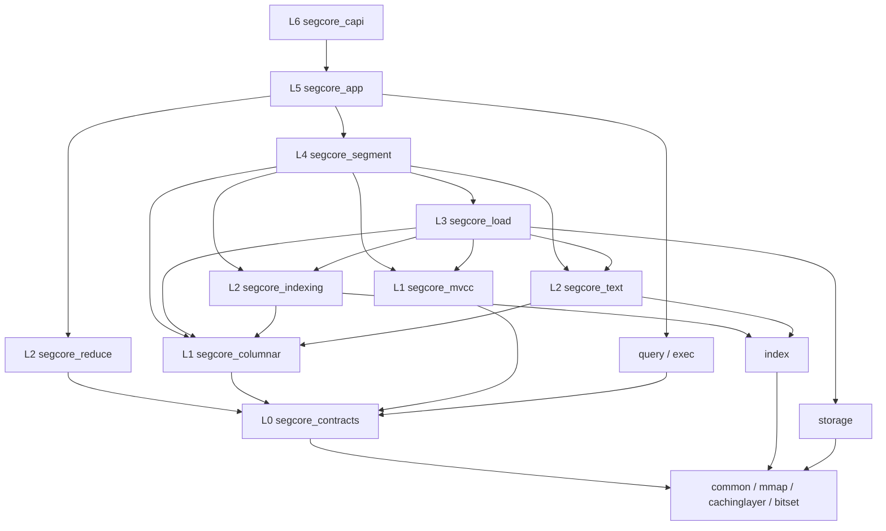

# Segcore 模块化重构设计（总览）

> **状态：设计提案，尚未实现。** 本目录描述的是重构的**目标形态**，不是当前代码的状态。
> 文中引用的现状事实基于 master `e255009e01`，行号可能随开发漂移。

## 1. 背景

`internal/core/src/segcore` 当前是一个"子系统容器"，不是边界清晰的模块。可观测的事实：

| 事实 | 数值 | 位置 |
|---|---|---|
| 生产文件行数 | ~46,700 行 / 145 个 .h+.cpp / 46 个生产 `.cpp` | `internal/core/src/segcore/` |
| CMake target 数 | **1 个**（`milvus_segcore` OBJECT，递归 glob） | `segcore/CMakeLists.txt:13` |
| `SegmentInterface.h` | 888 行、52 个 `#include`、89 处 `virtual` | `segcore/SegmentInterface.h` |
| Sealed 实现 | 9,949 行 | `segcore/ChunkedSegmentSealedImpl.cpp` |
| Growing 实现 | 3,378 行 | `segcore/SegmentGrowingImpl.cpp` |
| C ABI 单文件 | 2,727 行 | `segcore/segment_c.cpp` |
| query/exec 对 segcore 的 include（仅生产代码） | **74 处 / 50 个文件**；其中 `SegmentInterface.h` 39、`SegmentSealed.h` 7、`SegmentGrowingImpl.h` 5、`Utils.h` 5、`ConcurrentVector.h` 5 | `src/query/`、`src/exec/` |
| 测试与生产代码同目录 | segcore 下 46 个生产 `.cpp` + **38 个 `*Test.cpp`**，测试由递归 glob 全部扫进 `all_tests` | `unittest/CMakeLists.txt:31` |
| 测试链接面 | `all_tests` 链接完整 `milvus_core`，并全局开 `--allow-multiple-definition` | `unittest/CMakeLists.txt:141,151` |

结论：当前构建只能证明"所有代码放在一起可以链接"，无法证明"某个模块只依赖自己声明的接口"。

### 1.1 核心问题不是"文件太大"，是投影错了

`SegmentInterface` 把三类调用方向完全不同的能力压在同一个 vtable 上：

| 类别 | 典型方法 | 调用方 | 方向 |
|---|---|---|---|
| 控制面 | `LoadFieldData` / `Reopen` / `Load` / `SetLoadInfo` / `LazyCheckSchema` | load path、C ABI | 写 |
| 数据面读 | `chunk_data_impl` / `bulk_subscript` / `PinIndex` / `find_first_n` / `mask_with_delete` | query/exec | 读（热路径） |
| 编排 | `Search` / `Retrieve` / `FillTargetEntry` | C ABI | 依赖前两者 + query executor |

由此产生四个**可观测**的代价：

1. **依赖方向管不住** —— exec 拿到 `SegmentInterface*` 就能调 `Reopen()`，编译器无从拦截。这是 segcore ↔ query/exec 环的根因。
2. **头文件传染** —— `SegmentInterface.h` 传递性引入 `index/NgramInvertedIndex.h`、`geos_c.h`、`simdjson.h`、`cachinglayer/CacheSlot.h`。只想读一列数据的 TU 也付全额编译成本。
3. **测试造不出替身** —— 给 exec 写单测要 mock 89 个 virtual，于是所有人都选择"起一个真 segment"，测试必须链接整个 `milvus_core`。
4. **变更半径** —— 加一种 index 就改基类，全世界重编。

### 1.2 已确认的反向依赖边

| 反向边 | 证据 |
|---|---|
| `storage → segcore` | `storage/Util.cpp:68` include `segcore/memory_planner.h`，`:1504` 使用 `segcore::ParallelDegreeSplitStrategy` |
| `common → segcore` | `common/ArrayOffsets.cpp:36` include `SegmentInterface.h`，`:382` 把 `void*` 强转成 `SegmentInternalInterface*`；`common/init_c.cpp:35,36` include `memory_planner.h` 与 `storagev2translator/GroupCTMeta.h` |
| `index → segcore` | `index/json_stats/JsonKeyStats.cpp:27,60-63` include `default_fs.h`、两个 translator、`ChunkedSegmentSealedImpl.h`、`Utils.h`；`index/FMIndex.h:30` include `SegcoreConfig.h`。生产代码共 6 处 |
| `index → exec` | `index/NgramInvertedIndex.h:68,93` 直接接受 `exec::SegmentExpr*` |
| `segcore ↔ query/exec` | `SegmentInterface.cpp:154` 在 segment 内构造 `query::ExecPlanNodeVisitor`；`query/ExecPlanNodeVisitor.h:23,38` 与 `query/SearchOnGrowing.h:23` 反向 include segcore 具体实现 |

## 2. 目标与非目标

### 目标

- **编译期可验证的边界**：每个模块一个显式 source list 的 target，模块间依赖是单向 DAG，由 CI lint 强制。
- **能力窄化（capability narrowing）**：消费者只看到自己需要的接口，而不是整个 Segment surface。
- **可独立测试**：每个模块有自己的测试可执行文件，**不链接 `milvus_core`**。
- **实现下放**：`SegmentSealedImpl` / `SegmentGrowingImpl` 退化为 orchestrator。

### 非目标

- **不拆多个 DSO，也不重新引入组件间构建边**。历史 PR [#35610](https://github.com/milvus-io/milvus/pull/35610)（提交 `a773836b89`，2024-08）为 link-once / 修 ODR / 去掉组件间 target 边，把多个 SHARED library 合并成单一 core。本方案只拆**编译期** OBJECT/INTERFACE target，运行时仍然只产出一个 `milvus_core.so`，且模块间不建立 `target_link_libraries` 边（[§6](#6-构建与测试策略)）。
- **不追求构建并行度的提升**。拆 target 对编译并行没有影响（并行粒度是 TU）。构建时间的改善若有，来自头文件传染的减少，是重构的副产物而非目标。
- **不改变 Segment 这个领域抽象**。拆的是"Segment 对外的视图"和"impl 里并存的多个独立状态机"，不是把 Segment 这个实体拆开。
- **不做性能优化**。重构必须是性能中性的，热路径的虚调用粒度见 [03-columnar.md](03-columnar.md#5-性能约束)。
- **不考虑兼容性**（内部 C++ 接口，无外部契约）。

### 判定一段逻辑是否该搬出 SegmentImpl 的判据

> 如果一段逻辑在**不提 Segment 概念**的前提下也能描述清楚并单独测试（例如"给定一组 delete 记录和一个 ts，算出 bitmap"），它就不该写在 `SegmentImpl` 里。

这条比"按名字分类"可执行得多，贯穿所有模块文档。

## 3. 模块清单

| 层 | 模块 | 目录 | 职责一句话 | 文档 |
|---|---|---|---|---|
| L0 | `segcore_contracts` | `segcore/contracts/` | 能力接口与描述符，header-only，无实现 | [01-contracts.md](01-contracts.md) |
| L1 | `segcore_mvcc` | `segcore/mvcc/` | PK 映射、时间戳可见性、delete bitmap | [02-mvcc.md](02-mvcc.md) |
| L1 | `segcore_columnar` | `segcore/columnar/` | 列/chunk 数据访问与游标，pin 生命周期 | [03-columnar.md](03-columnar.md) |
| L2 | `segcore_indexing` | `segcore/indexing/` | index 清单、pin、能力描述；growing interim index | [04-indexing.md](04-indexing.md) |
| L2 | `segcore_text` | `segcore/text/` | TEXT 列缓存、LOB spillover、text index 资源 | [05-text.md](05-text.md) |
| L2 | `segcore_reduce` | `segcore/reduce/` | Search result reduce、结果物化与导出 | [06-reduce.md](06-reduce.md) |
| L3 | `segcore_load` | `segcore/load/` | LoadSpec / RuntimeInventory / ReopenPlanner / translators | [07-load.md](07-load.md) |
| L4 | `segcore_segment` | `segcore/segment/` | Sealed/Growing orchestrator、读写门、状态发布 | [08-segment.md](08-segment.md) |
| L5 | `segcore_app` | `segcore/app/` | Segment/Query/Flush 应用服务，异步调度 | [09-application.md](09-application.md) |
| L6 | `segcore_capi` | `segcore/capi/` | 薄 C ABI：类型转换 + 异常→CStatus | [10-capi.md](10-capi.md) |

`segcore/Utils.*` **不进入任何模块**——它会被拆解并删除，去向见 [11-cross-cutting.md](11-cross-cutting.md)。

## 4. 依赖图



**关键性质：`query/exec` 只依赖 `segcore_contracts`（L0），而 `segcore_app`（L5）依赖 `query/exec`。** 环因此被打开：底层数据接口不再认识 executor，编排层才认识。

## 5. 硬性依赖规则

这些规则由 CI lint 强制（见 [11-cross-cutting.md](11-cross-cutting.md#4-依赖-lint)），违反即构建失败：

1. **单向**：只允许 Lk 依赖 L(<k)。任意两个模块之间不得出现双向 include。
2. **`segcore_contracts` 不得 include**：`query/`、`exec/`、`storage/`、`segcore/` 下任何具体实现、任何 translator。允许 `common/`、`bitset/`。
3. **`query/` 与 `exec/` 不得 include `segcore/` 下除 `contracts/` 以外的任何头**。当前生产代码 74 处违规，是 P2/P3/P6 的迁移目标。
4. **`index/` 只允许 include `segcore/contracts/`；`storage/`、`common/` 不得 include `segcore/` 任何头**。当前生产代码违规：`index` 6 处、`common` 3 处、`storage` 1 处，修复方案见 [11-cross-cutting.md](11-cross-cutting.md#2-反向边修复清单)。
5. **`capi/` 不得 include** `query/`、`exec/`、任何 `*.pb.h` 解析逻辑、`folly` executor。
6. **不允许递归 glob**。每个 target 必须显式列出 source 文件。
7. **模块 target 之间不允许 `target_link_libraries`**，只允许 link INTERFACE 库。理由见 [§6](#6-构建与测试策略)。

## 6. 构建与测试策略

### 关键约束：模块间不建立 CMake target 边

**这是本方案与 [#35610](https://github.com/milvus-io/milvus/pull/35610) / [#35611](https://github.com/milvus-io/milvus/issues/35611) 兼容的前提，必须先讲清楚。**

#35611 提出「The compilation of different components should not depend on each other」，#35610 据此做了三件事：多个 SHARED library 合并成单个 `milvus_core.so`（link once）、修 ODR、**删除组件之间的 `target_link_libraries` 边**。

注意它**没有**把组件合并成一个 target。今天 `src/` 下仍有 16 个组件 target（15 个 OBJECT + `milvus_bitset` STATIC），每个只 link `milvus_conan_deps`（一个 INTERFACE 库，`src/CMakeLists.txt:88`），彼此零边。

这条纪律的成本是 generator 特定的，实测（CMake 4.2，OBJECT 库 A `target_link_libraries` B）：

| generator | 生成的边 | 编译并行 |
|---|---|---|
| Ninja | `cmake_object_order_depends_target_A: phony \|\| cmake_object_order_depends_target_B`，A 的 `.o` **不**依赖 B 的 `.o` | 不受影响 |
| Unix Makefiles | `CMakeFiles/A.dir/all: CMakeFiles/B.dir/all` | **A 全等 B 全**——这正是 #35611 描述的现象 |

`scripts/core_build.sh:203` 优先 Ninja、fallback Unix Makefiles，因此这条纪律主要保护 make 路径。

**本方案的规则：segcore 的 10 个模块 target 之间一律不写 `target_link_libraries`**，与现有 16 个组件保持一致的形态。依赖方向不靠 CMake 强制，靠 [§5 的 lint](#5-硬性依赖规则)——而且也只能靠 lint：`src/CMakeLists.txt:28` 的 `include_directories(${MILVUS_ENGINE_SRC})` 是目录级全局的，所有 target 本就能看见所有头，target 边给不了任何 include 隔离。

### target 形态

```cmake
# 每个模块：显式 source list 的 OBJECT target。
# 只 link INTERFACE 库，不 link 任何其他 OBJECT target。
add_library(segcore_mvcc OBJECT
    mvcc/PkIndex.cpp
    mvcc/DeletedRecord.cpp
    mvcc/TimestampVisibility.cpp
    ...)
target_link_libraries(segcore_mvcc PUBLIC milvus_conan_deps)

# contracts 是 header-only，INTERFACE 库不产生任何构建边
add_library(segcore_contracts INTERFACE)
```

运行时聚合不变：10 个 OBJECT target 与其余 15 个组件一起进 `milvus_core.so`（`src/CMakeLists.txt:141`），仍然只链接一次。

**拆 target 不影响编译并行度。** C++ 的编译并行粒度是 translation unit，不是 target：segcore 的 46 个生产 `.cpp` 今天在单个 target 里就是 46 路并行，拆成 10 个 target 之后仍是 46 路。拆 target 换来的是下面的测试形态，以及显式 source list 带来的归属可审查性。

### 测试形态

每个模块一个独立可执行文件，**只链接自己和自己的依赖**：

```cmake
add_executable(test_segcore_mvcc mvcc/test/*.cpp)
target_link_libraries(test_segcore_mvcc
    GTest::gtest_main
    segcore_mvcc          # 不是 milvus_core
    milvus_common)
```

测试可执行文件是构建图的**叶子节点**，因此它 link 模块 target 是允许的——这条边不会传导到 `milvus_core` 的构建路径上，与 §6 开头的纪律不冲突。

这条是整个重构**唯一不可妥协的验收信号**：如果一个模块的测试仍然需要 `milvus_core`，说明它的边界没有真正建立起来。**这也是拆 target 的主要理由**——要让 `test_segcore_mvcc` 只链接 mvcc 的对象，就必须有一个 target 能被引用；这件事单个大 target 做不到。

`all_tests` 保留，用于跨模块集成测试；但新增的模块级测试不得进入 `all_tests`。全局 `--allow-multiple-definition`（`unittest/CMakeLists.txt:141`）在模块测试目标上**不开启**。

## 7. 迁移路线

每个阶段独立可合入、可回滚，且必须保持 `all_tests` 全绿。

| 阶段 | 内容 | 出口标准 |
|---|---|---|
| **P0 骨架** | 建 `contracts/` 目录 + `segcore_contracts` INTERFACE target + 依赖 lint 脚本 + 一个空的 `test_segcore_contracts` | lint 进 CI；空测试目标不链接 `milvus_core` 即可通过 |
| **P1 mvcc** | 剥离 PK/timestamp/delete。最独立、最好测，先验证方法论 | `test_segcore_mvcc` 覆盖 delete bitmap 与 pk 查找，不链接 `milvus_core` |
| **P2 columnar** | 建 `IColumnChunkCursor`，把 `exec/expression/Expr.h` 的 chunk 遍历与 pin 生命周期迁入 | exec 中 `dynamic_cast<const Index*>`、`num_index_chunk_ == 1` 断言归零；性能基准无回归 |
| **P3 indexing** | scalar index pilot：三条窄合同落地，`FieldIndexing.cpp:820` 的 `CreateIndex` 选择逻辑收敛 | `test_segcore_indexing` 独立；exec 不再依赖具体 index 类型 |
| **P4 load** | `SegmentLoadInfo` 拆成 `LoadSpec`/`RuntimeInventory`/`ReopenPlanner`/`ProtoAdapter`；`memory_planner` 迁出到 `storage/` | `ReopenPlanner::Plan` 是纯函数并被单测覆盖；`storage → segcore` 反向边消失 |
| **P5 text / reduce** | TEXT LOB 与 reduce 独立；`FillTargetEntry` 系列从 `SegmentInternalInterface` 移出 | 两个模块各自独立测试 |
| **P6 app / capi** | `_c.cpp` 的业务逻辑迁入 `app/`，C ABI 变薄 | `capi/` 的 lint 规则通过；app service 有纯 C++ 单测 |
| **P7 收尾** | 删除 `segcore/Utils.*`，清理剩余反向边，`SegmentInterface` 退役 | 全部依赖规则通过；见下方验收标准 |

**P1 与 P2 顺序不可交换**：P2 需要 P1 提供的 mvcc 视图来构造不依赖 segment 的测试夹具。

## 8. 验收标准

重构完成的判定，全部可机械检查：

- [ ] `segcore/` 下不存在 `add_source_at_current_directory_recursively()`，每个 target 显式 source list。
- [ ] `segcore/**/CMakeLists.txt` 中不存在模块 target 之间的 `target_link_libraries`（只允许 INTERFACE 库）。
- [ ] 完整构建的墙钟时间与重构前差异 ≤ 5%（Ninja 与 Unix Makefiles 各测一次）。
- [ ] 每个模块存在 `test_segcore_<module>` 可执行文件，`target_link_libraries` 中**不含 `milvus_core`**。
- [ ] 依赖 lint 通过：无双向边，无跨层反向边，L0 头文件依赖集合 ⊆ {`common`, `bitset`, STL}。
- [ ] `query/` + `exec/` 对 `segcore/` 的 include 全部指向 `segcore/contracts/`。
- [ ] `index/`、`storage/`、`common/` 对 `segcore/` 的 include 数为 0。
- [ ] 每个 contract 头 ≤ 15 个 virtual 方法、≤ 15 个 `#include`。
- [ ] `segment/SegmentSealedImpl.cpp` ≤ 1,500 行；`segment/SegmentGrowingImpl.cpp` ≤ 1,000 行。
- [ ] `capi/*.cpp` 中不出现 `#include "query/`、`#include "exec/`、`folly::` executor、proto 解析。
- [ ] 构建产物仍然是单一 `milvus_core.so`，导出符号集合不变。
- [ ] 性能：`all_tests` 中的 search/retrieve 基准与重构前差异在噪声范围内（±3%）。

## 9. 文档索引

- [01-contracts.md](01-contracts.md) —— L0 能力接口
- [02-mvcc.md](02-mvcc.md) —— L1 PK / 时间戳 / 删除
- [03-columnar.md](03-columnar.md) —— L1 列与 chunk 访问
- [04-indexing.md](04-indexing.md) —— L2 索引访问与 growing interim index
- [05-text.md](05-text.md) —— L2 TEXT / LOB
- [06-reduce.md](06-reduce.md) —— L2 结果归并与物化
- [07-load.md](07-load.md) —— L3 加载与 reopen
- [08-segment.md](08-segment.md) —— L4 Segment orchestrator
- [09-application.md](09-application.md) —— L5 应用服务
- [10-capi.md](10-capi.md) —— L6 C ABI
- [11-cross-cutting.md](11-cross-cutting.md) —— Utils 拆解、反向边修复、依赖 lint
